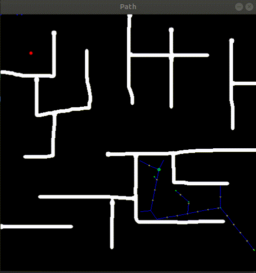
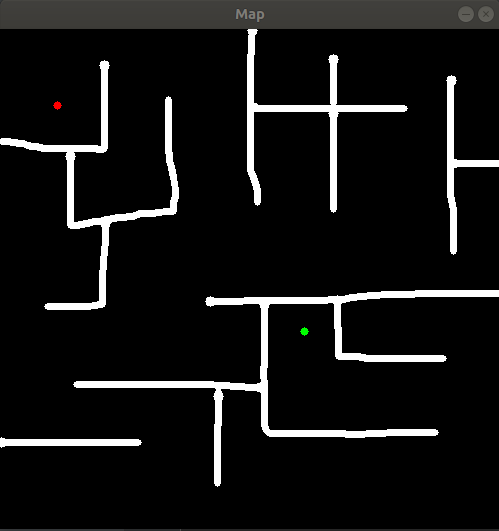

# Rapidly Exploring Random Tree (RRT) Planner

ROS package for a 2D path planner using the Rapidly Exploring Random Trees (RRT) algorithm. This repository contains two packages.

```
roslaunch planner rrt_planner.launch
```

## Installation

Clone this repository in a catkin workspace and run the following command to build the packages:

```
catkin build
```

## Planner

The planner package provides an implementation of the RRT algorithm.




To run the rrt planner node:
```
roslaunch planner rrt_planner_node.launch
```

The following parameters can be set in the launch file:

 - `map_topic (default: "/map")`: Topic where the map is published (type: *nav_msgs/OccupancyGrid*)
 - `goal_topic (default: "/goal")`: Topic where goal is published (type: *geometry_msgs/Pose2D*)
 - `pose_topic (default: "/pose")`: Topic where starting position is published (type: *geometry_msgs/Pose2D*)
 - `max_vertices (default: 1500)`: Maximum vertices to be added to graph after which goal search should be stopped
 - `step_size (default: 20)`: Size of steps. Bigger steps means smaller graphs but more time and vice versa


## Mapping

The mapping package provides a minimalistic GUI to draw obstacles in a 2D environment and choose starting position and goal.




To run the mapping node:
```
roslaunch mapping mapping_node.launch
```

The following parameters can be set in the launch file:

 - `map_topic (default: "/map")`: Topic where the map should be published (type: *nav_msgs/OccupancyGrid*)
 - `goal_topic (default: "/goal")`: Topic where goal should be published (type: *geometry_msgs/Pose2D*)
 - `pose_topic (default: "/pose")`: Topic where starting position should be published (type: *geometry_msgs/Pose2D*)
 - `height (default: 500)`: Height of map
 - `width (default: 500)`: Width of map
 - `resolution (default: 0.05)`: Resolution of map
 - `save_map (default: "none")`: If this parameter is set, the created map will be stored to this path 
 - `load_map (default: "none")`: If this parameter is set, map will be loaded from an image file at this path

When running the mapping node:
 - Press 'q' to quit
 - Press 's' to save and move on
 - Press numbers to the keyboard to change width of paint brush
 - Right-click to toggle between eraser and paint brush
